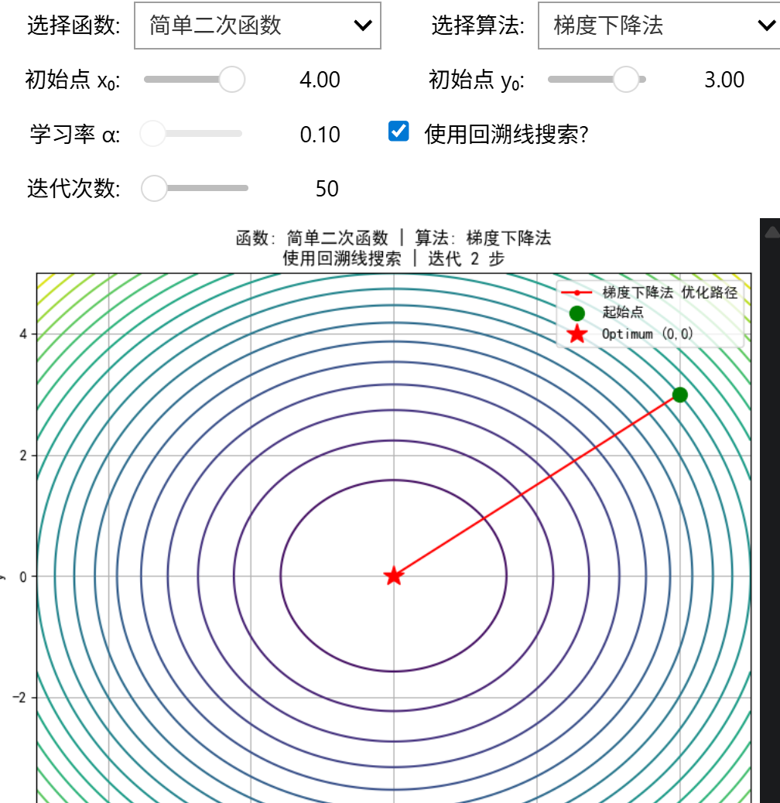
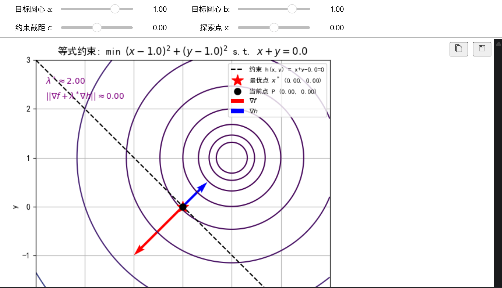
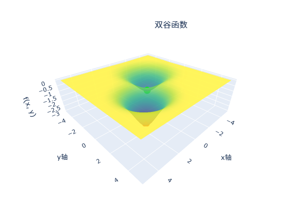

# 最优化方法与机器学习 第四章配套实验

本仓库整理《最优化方法与机器学习》第 4 章“最优化计算”的配套实验材料，供学生完成课堂实验、课后复现和课程作业使用。实验主体为可直接运行的 Jupyter Notebook，便于打开、运行、修改和整理实验结果。

本仓库实验设计与整理作者：**徐炀**

## 仓库简介

本仓库围绕无约束优化与相关数值计算方法展开，内容覆盖：

- 梯度与函数最小值的直观理解
- 梯度下降法的迭代过程与参数影响
- 次梯度法的基本探索
- 线性搜索与步长选择
- 梯度下降法、牛顿法、BFGS、L-BFGS 等方法的对比
- 约束优化中的拉格朗日乘子法与 KKT 条件

内容以实验学习和方法理解为主，适合边运行边观察算法行为，并结合实验现象完成结果分析。

## 教材信息

以下教材信息引用自中国科学技术大学出版社图书页面：

- 书名：**最优化方法与机器学习**
- 主编：**叶颀、谭露琳**
- ISBN：**9787030807168**
- 出版日期：**2025-02**
- 版次：**第 1 版**
- 中图分类号：**O242.23; TP181**
- 学科分类：**数学 / 计算机科学技术**
- 图书简介：本书系统介绍最优化理论与机器学习方法的结合，包含凸分析、最优性条件、最优化计算、邻近算法及应用等内容，可作为本科生、研究生相关课程教材与实验参考资料。
- 参考页面：[教材页面](http://159.226.241.44:8080/shop/book/Booksimple/show.do?id=B2E8F359001BB90B7E063010B0A0AE8BC000)

与本仓库直接对应的章节为：

- **第 4 章：最优化计算**

## 实验说明

本仓库将第 4 章实验按照 `4.1` 至 `4.6` 的目录进行整理，便于学生按章节逐步完成实验。每个实验目录中包含一个或多个 `ipynb` 实验文件。

## 实验界面预览
实际实验中可以通过调整参数、切换函数或更换算法，观察优化过程的变化。

### 示例 1



### 示例 2



### 示例 3



## 仓库结构

```text
.
├─ 4.1/
│  └─ 实验一.ipynb
├─ 4.2/
│  └─ 实验二.ipynb
├─ 4.3/
│  └─ 实验三.ipynb
├─ 4.4/
│  └─ 实验四.ipynb
├─ 4.5/
│  ├─ 实验五.ipynb
│  └─ 实验六.ipynb
├─ 4.6/
│  ├─ 实验七.ipynb
│  └─ 实验八.ipynb
├─ mdsource/       # 仅存放README展示用的示例图片，非实验核心文件
│  ├─ examplefig1.png
│  ├─ examplefig2.png
│  └─ examplefig3.png
├─ .gitattributes
├─ .gitignore
├─ README.md
└─ requirements.txt
```

## 实验清单

| 目录 | 实验文件 | 主题 |
| --- | --- | --- |
| `4.1` | `实验一.ipynb` | 梯度与函数最小值探索 |
| `4.2` | `实验二.ipynb` | 梯度下降法动态模拟 |
| `4.3` | `实验三.ipynb` | 次梯度算法探索 |
| `4.4` | `实验四.ipynb` | 线性搜索与最优步长 |
| `4.5` | `实验五.ipynb` | 梯度下降法与牛顿法对比 |
| `4.5` | `实验六.ipynb` | 牛顿法、BFGS 与 L-BFGS 对比 |
| `4.6` | `实验七.ipynb` | 拉格朗日乘子法与 KKT 条件 |
| `4.6` | `实验八.ipynb` | KKT 条件局限性分析 |

## 环境配置

建议使用以下环境：

- Python `3.10` 或更高版本
- `pip` 包管理工具
- `JupyterLab` 或 `Notebook`

安装依赖：

```bash
pip install -r requirements.txt
```

启动实验环境：

```bash
jupyter lab
```

若使用传统 Notebook，也可以执行：

```bash
jupyter notebook
```

## 依赖库

仓库需要依赖以下库，包括：

- `numpy`
- `matplotlib`
- `scipy`
- `pandas`
- `plotly`
- `ipywidgets`
- `jupyterlab`
- `notebook`
- `ipykernel`

如果交互控件未正常显示，请优先确认：

1. 已正确安装 `ipywidgets`
2. 使用的是较新的 `JupyterLab`
3. Notebook 内核与当前 Python 环境一致

## 推荐使用方式

1. 克隆或下载本仓库到本地。
2. 进入课程目录并安装依赖。
3. 启动 `jupyter lab`。
4. 打开对应实验目录中的 `ipynb` 文件。
5. 按照单元顺序逐步运行、记录结果并完成分析。
6. 若需提交课程作业，可基于 Notebook 导出 PDF 或 HTML，并结合课程要求整理实验报告。

## 给学生的建议

- 不要直接修改原始实验标题，建议在保留原始结构的基础上增加自己的分析单元。
- 图像没有显示时，优先重启内核并重新运行所有单元。
- 交互式实验建议在 `JupyterLab` 中完成。
- 若要提交课程报告，可在 Notebook 末尾添加“实验结论”“参数分析”“心得体会”等单元。
